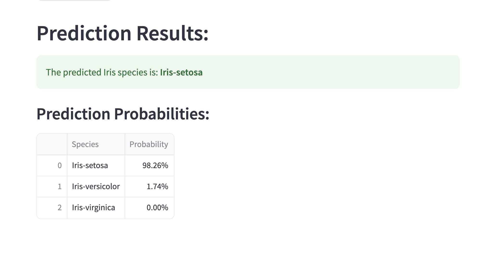

# Iris Species Prediction with Logistic Regression and Streamlit

## Overview
This project demonstrates a machine learning pipeline for classifying Iris flower species based on their sepal and petal measurements. It uses a Logistic Regression model trained with `scikit-learn` and deployed as an interactive web application using `Streamlit`.

## Features
- Predicts one of three Iris species (`Iris-setosa`, `Iris-versicolor`, `Iris-virginica`).
- User-friendly web interface for inputting measurements.
- Leverages a pre-trained Logistic Regression model for predictions.
- Data preprocessing (Standardization) applied to input features.

## Technologies Used
- Python 3.11.7
- scikit-learn
- pandas
- streamlit
- joblib

## Installation & Setup

1.  **Clone the repository:**
    Open your terminal or command prompt and run:
    ```bash
    git clone [https://github.com/daisymayorga-galtechs/irismodel](https://github.com/daisymayorga-galtechs/irismodel)
    cd irismodel
    ```

2.  **Install dependencies:**
    If you are using Anaconda, you can create a new environment or activate an existing one. Then, install the required Python libraries using pip:
    ```bash
    pip install -r requirements.txt
    ```

## How to Run the Application

1.  Ensure you have installed the dependencies in your chosen Python environment (e.g., your Anaconda `base` environment or a specific `conda` environment).
2.  Run the Streamlit application from your project directory:
    ```bash
    streamlit run app.py
    ```
3.  The application will automatically open in your default web browser (usually at `http://localhost:8501`).

## Model Performance Highlights (from testing)
- Accuracy: `0.9111`
- The model demonstrated excellent performance, especially on `Iris-setosa`. Minor confusions were observed between `Iris-versicolor` and `Iris-virginica` (as detailed in the confusion matrix).

## Screenshot
